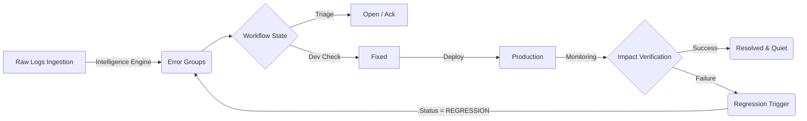
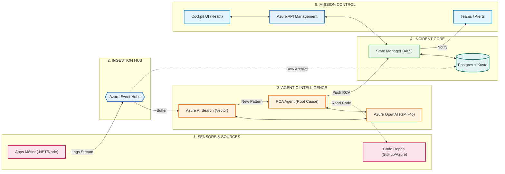

# Architecture Technique (Vue Macro)

Ce document présente l'architecture globale de la solution de suivi d'incidents ("Value Flux"). L'objectif est de transformer le bruit technique (logs) en action business mesurable.

## 1. Stack Technique

L'application est une **SPA (Single Page Application)** moderne, conçue pour la performance et l'expérience utilisateur.

- **Frontend Core** : [React](https://react.dev/) + [Vite](https://vitejs.dev/) (Build ultra-rapide).
- **Langage** : [TypeScript](https://www.typescriptlang.org/) (Typage strict pour la robustesse).
- **Styling** : [Tailwind CSS](https://tailwindcss.com/) (Utility-first) + [Shadcn/UI](https://ui.shadcn.com/) (Composants accessibles et modernes).
- **Routing** : [React Router v6](https://reactrouter.com/) (Gestion des vues Cockpit / Détails).
- **Gestion d'État** : React Context API (Pas de Redux/Zustand nécessaire pour ce MVP, état local suffisant et performant).

## 2. Flux de Données (The Value Flux)

L'architecture repose sur un pipeline de données unidirectionnel qui transforme la donnée brute en information qualifiée.



### Modules Clés

1.  **Ingestion & Intelligence Layer (`src/lib/intelligence-engine.ts`)**
    -   *Rôle* : Simule une IA qui analyse les logs entrants.
    -   *Mécanisme* : Vectorisation simulée (Pattern Matching) pour regrouper des logs similaires en un `ErrorGroup` unique. Évite le bruit et les doublons.

2.  **Incident Context (`src/stores/IncidentContext.tsx`)**
    -   *Rôle* : "Single Source of Truth". Stocke l'état vivant de tous les groupes d'erreurs.
    -   *Responsabilité* : Notifie l'UI lors de changements d'état (ex: un log arrive -> le compteur s'incrémente -> l'UI se met à jour).

3.  **Vues Utilisateur**
    -   **Cockpit (Mission Control)** : Agrégation par Application. Calcul de la "Dette Technique" (Ratio Fix/Open).
    -   **App Details (Flux View)** : Vue détaillée du cycle de vie des erreurs pour une application donnée.

## 3. Structure du Projet

```
src/
├── components/         # Composants UI atomiques (Cards, Buttons...)
├── layouts/           # Structure globale (Sidebar, App Shell)
├── lib/               # Logique métier pure (Intelligence Engine)
├── pages/             # Vues principales (Cockpit, AppDetails)
├── stores/            # Gestion d'état global (IncidentContext)
└── types/             # Définitions de données (ErrorLog, ResolutionState)
```

## 4. Sécurité & Performance

-   **Client-Side Logic** : Tout le traitement (pour le moment) se fait côté client pour une réactivité immédiate (Optimistic UI).
-   **Extensibilité** : L'architecture est prête pour être connectée à une API REST ou GraphQL. Le `IncidentContext` servirait alors de cache/layer de synchronisation.

## 5. Architecture Cible (Target Synthetisée)

Cette vue "Pipeline de Valeur" simplifie la compréhension des flux de données et de décisions.



### Détail des Composants (Glossaire)

Voici l'explication rôle par rôle des éléments du schéma ci-dessus.

#### 1. SENSORS & SOURCES (L'Entrée)
*   **Apps Métier** : Vos applications en production (.NET, Node, Java). Elles émettent de la télémétrie (Logs, Traces) via des SDKs comme OpenTelemetry ou Application Insights.
*   **Code Repos (GitHub/Azure)** : Le stockage de votre code source. L'accès à cette brique est critique pour que l'Agent puisse "lire" le code fautif et comprendre *pourquoi* une erreur survient.

#### 2. INGESTION HUB (L'Amortisseur)
*   **Azure Event Hubs** : C'est la "boîte aux lettres" haute performance. Il encaisse des millions de logs/sec sans broncher. Il permet de découpler les apps (qui envoient vite) du cerveau (qui réfléchit plus lentement).

#### 3. AGENTIC INTELLIGENCE (Le Cerveau)
*   **Azure AI Search (Vector)** : La mémoire sémantique. Au lieu de chercher des mots-clés exacts ("NullReferenceException"), il cherche le *sens* de l'erreur via des vecteurs. C'est ce qui permet de dire "C'est la même erreur que la semaine dernière, mais écrite différemment".
*   **RCA Agent (Root Cause Analysis)** : Le travailleur autonome.
    1.  Il écoute les nouveaux clusters d'erreurs.
    2.  Il va chercher le code source correspondant dans le Repo.
    3.  Il compile le tout et l'envoie au LLM.
    4.  Il rédige un rapport d'investigation.
*   **Azure OpenAI (GPT-4o)** : Le moteur cognitif. Il ne stocke rien, il "comprend" juste le code et l'erreur pour proposer un diagnostic et une correction.

#### 4. INCIDENT CORE (Le Hävre de Paix)
*   **State Manager** : Le microservice (sur AKS) qui gère la logique métier. Il maintient l'état officiel de l'incident (Est-ce que c'est "Nouveau" ? "Assigné" ? "Résolu" ?).
*   **Postgres** : Stockage "Chaud". Contient les tickets d'incidents, les commentaires, l'état du workflow. Rapide et transactionnel.
*   **Kusto (ADX)** : Stockage "Tiède/Froid". Contient l'historique brut des millions de logs. Utile pour fouiller dans le passé si besoin (Forensics).

#### 5. MISSION CONTROL (La Sortie)
*   **Azure API Management** : Le portier. Il sécurise l'accès aux données (Auth, Quotas) pour que le Frontend ne tape pas directement dans la base de données.
*   **Cockpit UI** : L'interface React que nous avons développée. Elle affiche la synthèse (Dette Tech) et les détails (Flux).
*   **Comms (Teams)** : Le lien humain. L'agent y poste ses rapports RCA pour que les développeurs n'aient pas à aller chercher l'info.

